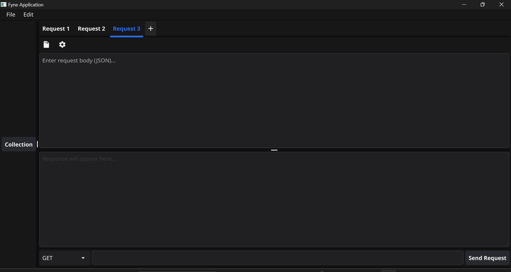

# Mini Postman 📨

A lightweight, desktop HTTP client built with [Go](https://golang.org) and [Fyne](https://fyne.io) — inspired by Postman, but simpler, faster, and open-source.

---

## ✨ Features

- 🌐 Send HTTP requests (`GET`, `POST`, `PATCH`, `DELETE`)
- 📝 Write custom request bodies in JSON
- 📬 View raw responses (JSON, HTML, plain text)
- 🔀 Real-time split pane for request and response
- 🖼️ Auto-detects and formats HTML/JSON responses
- 🪟 Built with Fyne — native cross-platform GUI

---

## 📸 Screenshot




---

## 🚀 Getting Started

### Prerequisites

- Go 1.18+
- (Optional) Fyne CLI for packaging: `go install fyne.io/fyne/v2/cmd/fyne@latest`

### Installation

Clone the repo:

```bash
git clone https://github.com/your-username/mini-postman.git
cd mini-postman
go run main.go
```


## Author
Made with 💙 by Godstime
