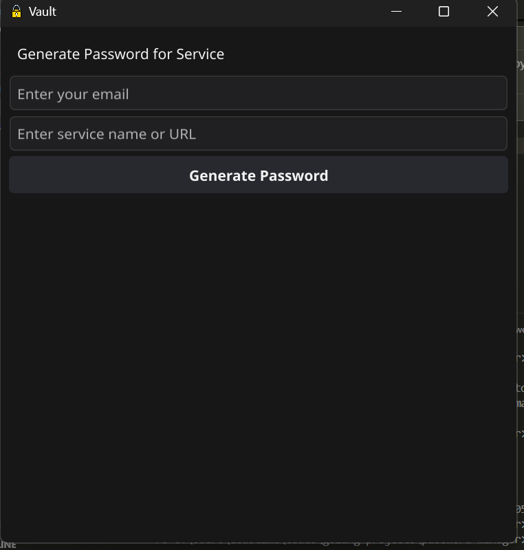
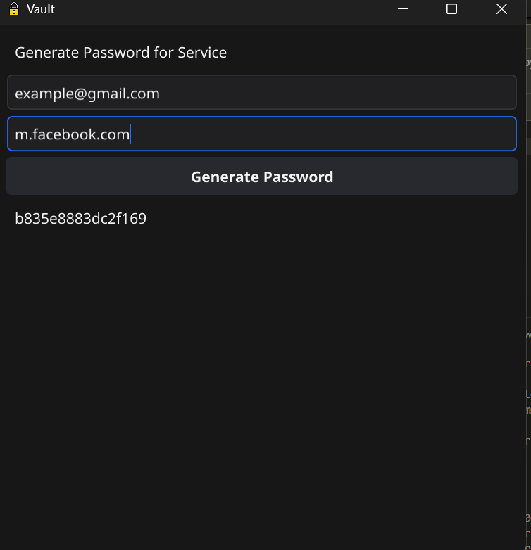

# 🔐 Stateless Password Manager

A lightweight, offline password generator built with [Fyne](https://fyne.io) in Go — inspired by [joaomilho/vault-desktop](https://github.com/joaomilho/vault-desktop). No database. No sync. No storage. Just a strong, repeatable password generated locally using your master passphrase.

---

## ✨ Features

- ✅ **Stateless password generation** — no saved data
- 🔐 Secure password hashing using `SHA-256` + `Base64`
- 📬 Input: `Master password`, `Email`, and `Service name`
- 💡 Always generates the same strong password for the same inputs
- 🧠 You only need to remember one **master password**
- 📦 Built with [Fyne](https://fyne.io) — a beautiful native GUI for Go

---

## 🧠 How It Works

This app uses your inputs to deterministically generate a unique password.

The hash is then base64-encoded and truncated (e.g. to 20 characters) for usability.

✅ You get the same password every time you use the same inputs.

❌ If you forget your master password or change the email/service name even slightly, the password will be different.

---

## 🚫 No Storage, Ever

This app doesn't:
- Store your passwords
- Save to a cloud
- Sync with any server

Your data stays **100% local** and **ephemeral** — perfect for those who don't want to rely on third-party password managers.

---

## 🖥️ Screenshot

> Not generated password

> generated password screen
---
